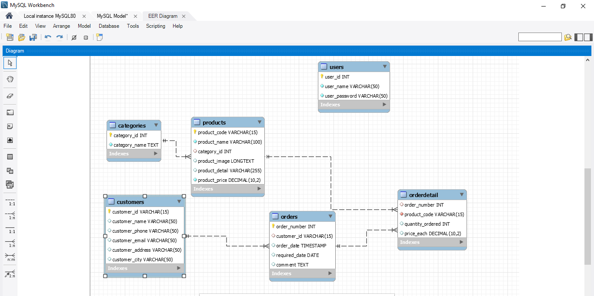

Tên Đề tài: Trang quàn lí bán hàng.

Bao gồm các trang: quản trị và trang dành cho người dùng

- Trang dashboard: Thêm sửa xóa sản phẩm. +Thông tin khách hàng. +Thêm sửa xóa trạng thái của các order.
- Trang dành cho người dùng:
 + Trang chủ
 + Trang từng loại sản phẩm 
 + Trang chi tiết sản phẩm
 + Giỏ hàng

 - sơ đồ ERD:
 